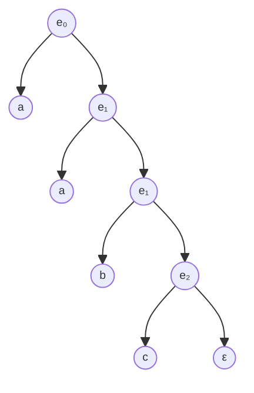

# Gramáticas y Lenguajes Formales
## Operaciones básicas sobre alfabetos, cadenas y lenguajes
1. Sea el alfabeto V={a,b,c}. Indique cinco de las cadenas pertenecientes a V\* y V+.
	$V{^*}=\{ \lambda, a, b,c,ab,abc \}$
	$V{^+}=\{ a,b,c,ab,abc,aabc \}$
2. Sean los alfabetos ∑1={0,1} y ∑2={a,b}. Defina por extensión:
	1. $\sum_{1}{^2}=\{ 00,01,10,11 \}$
	2. $\sum_{2}{^+}=\{ a,b,aa,ab,bb,aab,aba,bbb, \dots \}$
	3. $\sum_{1}.\sum_{2}=\{ 0a,0b,1a,1b \}$
3. Sean los lenguajes A={xy,yz} y B={wqq,vw}. Determine el resultado de la concatenación A⋅B.
	$A.B=\{ xywqq,yzwqq,xyvw,yzvw \}$
4. Sea A={01,10}. Determine el resultado de las operaciones: A0,A1,A2,A3.
	$A{^0}=\{ \lambda \}$
	$A{^1}=\{ 01,10 \}$
	$A{^2}=\{ 0101,0110,1001,1010 \}$
	$A{^3}=\{ 010101,010110,011001,011010,100101,100110,101010,101001 \}$
5. Sean A={a,b,c,d} y B={c,d,e,f}. Determine el resultado de A U B.
	$A \cup B=\{ a,b,c,d,e,f \}$
6. Sean A={m,n,o,p} y B={o,p,q,r}. Determine el resultado de A Ո B.
	$A\cap B = \{ o,p \}$
7. Sea A={radar, anilina, reconocer}. Determine el resultado de AR o A-1.
	$A{^{-1}} = \{ radar,anilina,reconocer \}$
8. Defina un lenguaje finito sobre el alfabeto ∑1={0,1}.
	$L(\sum_{1})=\{ 0,1,01,10,11,00,001,010,100 \}$
## Reglas de derivación y transformaciones
9. Dada las reglas de producción {ab→bb,bb→a}, para la palabra "aab", obtenga las derivaciones por derecha.
	$aab\to abb\to aa$
10. Dadas las reglas de producción {xy→z, zz→yx}, para la palabra "xxyz", obtenga las derivaciones por izquierda.
    $xxyz\to xzz\to xyx\to zx$
11. Dadas las reglas de producción {10→01,001→110}, indique la palabra que se obtiene al aplicar derivación por derecha sobre la palabra "1001".
12. Dadas las reglas de producción {ab→ba,baa→ab}, indique la palabra que se obtiene al aplicar derivación por izquierda sobre la palabra "bbaa".
13. Determine la longitud de las palabras w=abab, v=000111, c=λ.
    $|w|=4,|v|=6,|c|=0$
14. Indique cuáles de las siguientes reglas de producción son reglas compresoras.
    $b \text{ y } c$ son reglas compresoras.
## Gramáticas y lenguajes
15. Defina el conjunto de producciones P, de la gramática de G = { {S, A, B, C}, {0, 1}, S, P } que genere la cadena: 001010.
	$$\begin{align}
	S &\to 0A \\
	A &\to 0B \\
	B &\to 10C \\
	C &\to 10
	\end{align}$$
	$S\to 0A\to 00B \to 0010C \to 001010$
16. Defina el conjunto de reglas de producción P de la gramática G=({S,A,B},{0,1},S,P) que genere la cadena: 101001.
17. Dada una gramática tipo 2 (independiente del contexto), no estricta, G = ({A, S}, {a, b, c}, P, S), determine el conjunto de reglas de producción P, que generan el lenguaje $L2=\{w.x{^n}.w{^R} / w∈{a,b}, n>0\}$.
    $$\begin{align}
	S &\to aSa |bSb | A\\
	A &\to xA | x 
	\end{align}$$
18. Defina las reglas de producción para el lenguaje $L=\{a{^n}b{^m}c{^{n+m}} /n,m>0\}$.
    $$\begin{align}
	S &\to aSc | bSb | A \\
	A &\to bAc | bc
	\end{align}
	$$
19. Defina las reglas de producción para el lenguaje $L=\{a{^n}b{^m}c{^{2(n+m)}}/n,m>0\}$. 
20. Dado el siguiente conjunto de reglas de producción de una gramática, P={e0→ae1, e1→ae1|be2, e2→be2|c}, dibuje el árbol de derivación concreto para la cadena **aabbc**.
    $$
    e_{0}\to ae_{1}\to aae_{1}\to aabe_{2}\to aabbe_{2}\to aabbc
$$

21. Sea la gramática G=({S,A,B},{0,1},P,S), donde P={S→A1B, A→0A∣λ, B→0B∣1B∣λ}, indique 3 cadenas válidas y dibuje sus respectivos árboles de derivación.
## Árboles de derivación y ambigüedad
22. Dibuje el árbol de derivación para la cadena z=(x+y)∗z, correspondiente a las producciones: 
    ASSIGN -> ID '=' EXPR 
    ID -> 'x' | 'y' | 'z' 
    EXPR -> ID '+' EXPR | EXPR '\*' ID | '(' EXPR ')' | ID
23. Analice si la siguiente gramática genera cadenas ambiguas y justifique su respuesta. $P = \{ S \to S + S | S * S | (S) | a \}$
	$$\begin{align} \\
	S&\to S+S &| S &\to S*S \\
	S&\to a+(a*a) &| S&\to(a+a)*a
	\end{align}
	$$
	La gramática es ambigua ya que generan la misma cadena con distintos árboles de derivación.
## Gramáticas regulares y recursión a izquierda
24. Dada la gramática, G=({S},{a,b},P,S), con P={S→Sa ∣ Sb ∣aS ∣ b ∣ λ}, elimine la recursividad a izquierda.
    $$
	\begin{align}
	S &\to bS' \\
	S &\to S' \\
	S' &\to aS' \\
	S' &\to bS' \\
	S' &\to \lambda
	\end{align}
	$$
25. Dada la gramática G=({S,A},{a,b,c},P,S), con P={S→Ac, A→Sa ∣ b}, elimine la recursividad a izquierda.
    $$
	\begin{align}
	A &\to Aca | b \\
	S &\to Ac \\
	A &\to bA' \\
	A' &\to caA' | \lambda
	\end{align}
	$$
26. Escriba las reglas de producción para la gramática G= ({A,S}, {a, b, c}, P, S), no ambigua, que reconoce el lenguaje $L_{1} = \{w.c.w{^R} / w \in \{a | b\} \text{ y } R > 0\}$
    $$
\begin{align}
S &\to c | aSa | bSb | aAa | bAb \\
A &\to c
\end{align}
$$
27. Completar las reglas de producción para la gramática G = ({A, B, S}, {a}, P, S), regular lineal a derecha, que genera $L = \{a^{2n} / n ≥ 0\}$
$$
	\begin{align}
	S &\to \epsilon \\
	S &\to aA \\
	A &\to aB \\
	A &\to \epsilon \\
	B &\to aS
	\end{align}
	$$
28. De acuerdo a la Jerarquía de Chomsky, indique el tipo al que pertenece cada una de las siguientes gramáticas.
	- Esta gramática es de tipo 0, la regla "AB -> BA" no se ajusta a las restricciones de tipo 1, 2 o 3.
	$$
	\begin{align}
	S &\to aSb | \epsilon \\
	aS &\to aaS
	\end{align}
	$$
	- Esta gramática es de tipo 0, la regla "AB -> BA" no se ajusta a las restricciones de tipo 1, 2 o 3.
	  $$
	\begin{align}
	AB &\to BA \\
	aA &\to \epsilon \\
	Bba  &\to b
	\end{align}
	$$
	- Esta gramática es de Tipo 2 ,todas las reglas tienen un solo no terminal en el lado izquierdo.
	$$
	\begin{align}
	S  & \to aA \\
	A  & \to bAa | a
	\end{align}
	$$
	- Esta gramática es de Tipo 2,todas las reglas tienen un solo no terminal en el lado izquierdo.
	$$
	\begin{align}
	S  & \to aSb | bSa | \epsilon
	\end{align}
	$$
## Notación BNF, EBNF y Diagramas Sintácticos
29. Defina una gramática en notación BNF (Backus Naur Form), que genere listas de números naturales. Ejemplo: 0,1,2,11,25,301.
```
<numero_natural> ::= <digito><numero_natural> | <digito>
<digito> ::= '0'|'1'|...|'9'
```
30. Pase la gramática del ejercicio anterior a notación EBNF (Extended Backus Naur Form).
```
<numero_natural> ::= <digito> {<digito>}^*
<digito> ::= '0'|'1'|'2'|...|'9'
```
31. Exprese el equivalente del siguiente diagrama sintáctico, en notación EBNF. ![[imgs/tp1ej31.png| center]]
```
if_then_else ::= 'if'<expresion> 'then'<instruccion> ['else'<instruccion>]
```
32. Dibuje el diagrama sintáctico equivalente a la siguiente expresión en notación EBNF.
$<funcion>  ::= 'function'  <identificador>  '(' [<parametro> \{"," <parametro>\}^{*}] ')' '\{' \{<sentencia> ';'\}^{*} ['return' <expresion> ';'] '\}'$
![[imgs/tp1ej32| center]]

33. Exprese el equivalente del siguiente diagrama sintáctico, en notación EBNF y BNF: ![[imgs/tp1ej33.png| center]]
- BNF
```BNF
<expresion> ::= "(" <lista-elementos> ")" | "(" ")" | "(" <lista-elementos> ")" ":" Qualident | "(" ")" ":" Quealident
<lista-elementos> ::= <elemento> | <elemento> "," <lista-elementos"
<elemento> ::= VAR | FormalType
```
- EBNF 
```EBNF
<expresion> ::= "(" <elementos>^* ")" [":" Qualident]
<elementos> ::= [VAR | FormalType]["," <elementos>]
```
## Notaciones algebraicas: prefija, infija y postfija
34. Re-escriba las siguientes expresiones en notación prefija (polaca) y postfija (polaca inversa). Dibuje el árbol de evaluación.
    z=x+y-++z\*4;
    (x/2-y\*y\*y+3/4\*x)\*(2+x++)
	![[imgs/tp1ej34.png| center]]
	- Prefija: +x-y\*++z4
	- Postfija: xyz++4\*-+
35. Dadas las siguientes expresiones en notación prefija (polaca), obtenga su equivalente en notación infija.
    / (+ (- b) (- (\* b b) (\* 4 (\* a c)))) (\* 2 a)
	-  -b+(b^2  2a c^2)
    \+ (- (\* 4 (\* x (\* x x))) (\* 3 (\* x x))) (+ (\* 2 x) -1)
	- 12x3+(3x-1)
36. Dadas las siguientes expresiones en notación postfija (polaca inversa), obtenga su equivalente en notación infija
    x x \* x \* 5 \* x 2 \* - +
	- 5x3x2x-
	 a 3 \* b 2 \* + c 5 \* + 10 /
	 - (3a+2b+5c)+10