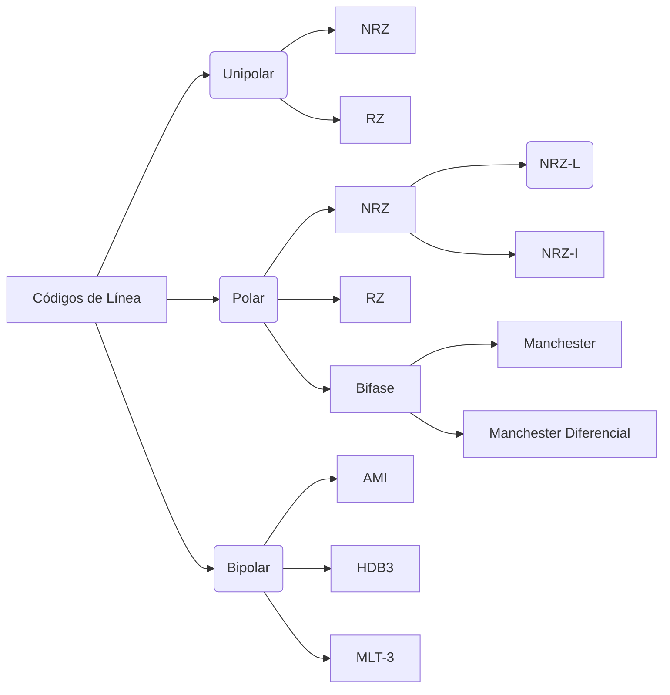

# Técnicas de Codificación
Se clasifican en:
- Códigos de Bloque -> se utilizan para la detección de errores
- Códigos de Línea -> se utilizan para la transmisión
## Códigos de Línea
Los códigos de línea son la representación de la banda base digital, para la transmisión de una fuente a un destino. Los unos y ceros se representa en varios formatos de señalización de bits (códigos de línea). Se realiza por medio de circuitos de "conversores de código".
###### Propiedades
- Auto sincronización: señal para la temporización (un bit)
- Nivel de continua baja: lo más baja posible. Evitar una interpretación errónea, que genere un dato erróneo 
-  Capacidad de detección de errores: debe ser posible detectar y corregir el error en la detección
- Baja probabilidad de error de bits: inmuinidad al ruido
- Transparencia: independencia de las características del código en relación a la secuencia de unos y ceros que se transmita
- Eficiencia: capacida de la información original y de su código

### Codificación Unipolar
Se denomina unipolar porque usa únicamente una polaridad, esta polaridad se asigna a uno de los estados binarios, habitualmente el 1, el otro estado binario es el 0 que se representa por el nivel 0 de tensión.

| Sin Retorno a Cero (NRZ)                                                                                                                        | Con Retorno a Cero (RZ)                                                                                                                        |
| :---------------------------------------------------------------------------------------------------------------------------------------------- | :------------------------------------------------------------------------------------------------------------------------------------------------ |
| El nivel de tensión se mantiene constante durante la duración del bit y no hay transiciones, es decir, no hay retorno al nivel cero de tensión. | El nivel de tensión se mantiene constante y a la mitad de la duración del bit hay una transición, es decir, hay retorno al nivel cero de tensión. |
| ![[NRZ.png]]                                                                                                                                    | ![[NR.png]]                                                                                                              |
#### Deseventajas
- **Componente de Continua DC:** La amplitud media de una señal con codificación unipolar no es cero, eso crea lo que se llama una componente de corriente continua (señal de frecuencia cero). Cuando una señal contiene una componente continua, no puede viajar a través de medios que no pueden gestionar este tipo de componentes.
- **Sincronización**: Cuando una señal no varía, el receptor no puede determinar el principio y el final de cada bit, por tanto puede tener problemas de sincronización siempre que el flujo de datos contenga una larga serie ininterrumpida de ceros y unos.
- **No son convenientes para aplicaciones de transmisión de señales**.
### Codificación Polar
Usa dos niveles de tensión, uno positivo y uno negativo, de ésta manera se reduce el nivel de tensión medio de la línea y se alivia el problema de la componente DC existente en la codificación unipolar.
#### NRZ

| NRZ-Level                                                                                                    | NRZ-Inverted                                                                                  |
| :----------------------------------------------------------------------------------------------------------- | :-------------------------------------------------------------------------------------------- |
| Trabaja por Nivel, es decir, dando un valor de nivel positivo al bit 1 y un valor de nivel negativo al bit 0 | El 1 representa una inversión del nivel de voltaje. Un bit 0 se representa sin ningún cambio. |
| ![[NRZ-L.png]]                                                                                               | ![[NRZ-I.png]]                                                                                |
**NRZ-I es mejor que el NRZ-L**: debido a la sincronización implícita provista por el cambio de señal cada vez que se encuentra un 1.
##### Desventajas códigos NRZ
- Presencia de una componente de continuna DC.
- Ausencia de capacidad de sincronización.
- Las secuencias de cero todavía pueden causar problemas, aunque sean menos frecuentes.
- Estos códigos se usan con frecuencia en las grabaciones magnéticas, pero *no son convenientes para aplicaciones de transmisión de señales*.
#### RZ
Se lo conoce como autosincronizante ya que indica al receptor cuando se está transmitiendo un bit (0 o 1) durante el tiempo de transmisión, haciendo una transición para volver al valor cero.
![[RZ.png]]
$\to$ El problema con estos códigos es que las secuencias largas de ceros todavía pueden causar problemas.
#### Bifásica
Estos códigos son muy utilizados en la transmisión de redes Ethernet.

| Manchester                                                                                                                                                                        | Manchester Diferencial                                                                                                                                                                                                                                                                                                                                                                                   |
| --------------------------------------------------------------------------------------------------------------------------------------------------------------------------------- | -------------------------------------------------------------------------------------------------------------------------------------------------------------------------------------------------------------------------------------------------------------------------------------------------------------------------------------------------------------------------------------------------------- |
| Hacen un cambio de nivel a la mitad del período del bit, de esa manera mantienen el sincronismo. Se utiliza un patrón para representar el bit 1 y otro para representar el bit 0. | Este código es igual al Manchester con la diferencia de que en lugar de seguir un patrón para indicar el bit 1 y el 0, hace una transición de positivo a negativo, o viceversa, al comienzo del período del bit para indicar que es un bit 1, y si se trata de un bit 0, no cambia el valor de voltaje que traía del período anterior. La transición a la mitad del período del bit se mantiene siempre. |
| ![[Manchester.png]]                                                                                                                                                               | ![[Manchester Diferencial.png]]                                                                                                                                                                                                                                                                                                                                                                          |
### Codificación Bipolar
Usa 3 tipos de codificación usa tres niveles de tensión: POSITIVO, NEGATIVO y NULO
Los objetivos en el diseño de estas técnicas son:
- Evitar la componente continua
- Evitar las secuencias largas que correspondan a señales de tensión nula
- No reducir la velocidad de datos
#### AMI
- Codifica sólo los bits 1, en forma alternada y no codifica los bits 0.
- Una secuencia larga de ceros puede causar problema.
- Existe una AMI - RZ

| AMI          | AMI-RZ          |
| ------------ | --------------- |
| ![[AMI.png]] | ![[AMI-RZ.png]] |
#### HDB-3 (High Density Bipolar 3 zeros)
- Este tipo de codificación se basa en el AMI, es decir, codifica sólo los bits 1 en forma alternada.
- Cada 4 bits 0 consecutivos se evalúan y aplican en su construcción tres reglas, con el objetivo de que no se transmitan más de 3 ceros consecutivos y de esa manera mantener el nivel de continua a cero, el sincronismo y un buen espectro de frecuencia
- Reglas:
1. **Al 4to bit 0 consecutivo se debe insertar un BIT DE VIOLACIÓN**, es decir , se debe codificar ese 4to bit 0 con la misma polaridad que el último bit 1 codificado, antes de los 4 bits ceros.
2. **Los BIT DE VIOLACION deben tener polaridad alternada entre sí**. Es decir, que si tenemos un BIT DE VIOLACIÓN que por la primer regla, queda con polaridad positiva, y existe un BIT DE VIOLACIÓN anterior con polaridad positiva, se debe cambiar la polaridad del nuevo BIT DE VIOLACIÓN a negativa.
3. Si al colocar el BIT DE VIOLACION, por cumplir con la segunda regla, no se llegara a cumplir la primer regla, es decir, que la polaridad del BIT DE VIOLACIÓN no fuese la misma que la del último bit 1 codificado, se deberá codificar el primero de los bits 0 del cuarteto, con la misma polaridad que la que le ha quedado al BIT DE VIOLACIÓN. Este bit se llama **BIT DE RELLENO**.
- De ésta manera se establece un patrón que indica al receptor la secuencia de 4 bits ceros consecutivos.

| HDB-3          | HDB-3-RZ                             |
| -------------- | ------------------------------------ |
| ![[HDB-3.png]] | ![[HDB-3-RZ.png]] |
#### MLT-3
- Trabaja en forma escalonada codificando solamente los bits 1.
- Es un código de cambio de nivel, codifica el bit 1 cambiando de nivel positivo a cero, de cero a negativo y luego en el sentido inverso, solamente si se trata de un bit 1. Los bits 0 no se codifican, es decir no se cambia el valor de voltaje que traía.
![[MLT-3.png]]
## Codificación en placas de Red
**Codificar**: asignar un valor de tensión al uno binario, y otro distinto al cero. Deben ser perfectamente detectados por el receptor, para no cuantificarlo.
Es necesario transmitir los datos y la señal de sincronismo (clock), lo cual nos implicaba **hacer 2 enlaces**. Una alternativa a esto, para hacer solo un enlace, era poder extraer el clock de los mismos datos.
### Formas de Codificación
**Códigos de línea**: Son códigos para la transmisión. Se llaman de línea, porque a medidaque los datos se van generando, se van codificando. Cond
> [!info] Condiciones:
> - Permitir extraer el código de los datos
> - Que el nivel de corriente continua en el enlace, sea constante, en lo posible, 0 Volts. Es decir, conviene que el código sea polar.
> - Que el espectro de energía sea adecuado, y reducido.

#### Códigos de Línea para redes LAN
1. Código Manchester
	Este código es por cambio de nivel y bipolar. Lo utiliza la placa de red cuando transmite a 10Mbps.
2. Código MLT-3
	Se utilizó en redes LAN de 100 Mbps.
#### Códigos de Línea para redes WAN
1. AMI
	El código AMI fue usado extensamente en la primera generación de redes PCM, Más utilizado por las normas norteamericanas.
1. HDB-3
## Códigos de Bloque
Aquí codificamos de a bloques de bits, es decir, voy a tomar un conjunto de bits y recién ahí los voy a enviar.
# Conmutación
El conmutador es un dispositivo importante en toda red de comunicación, porque cumple la función de conectar los usuarios entre sí.
- Garantizar que llegue la información
- Debe ser transparante al usuario
- Debe ser rápida
 ![[resumen conmutacion.png]]
 